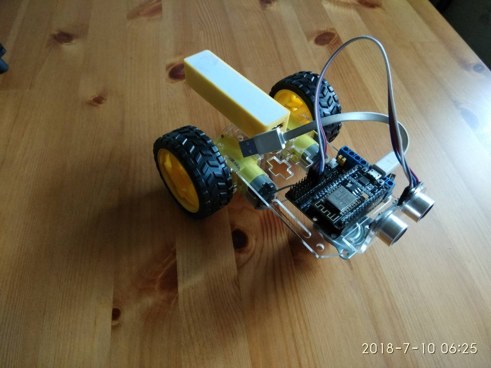

# MicroPython-Car

使用 MicroPython + Jupyter Notebook 來玩小車

## 基本元件操作

### 請參考 <a href="https://github.com/maloyang/MicroPython-Car/edit/master/car basic.ipynb">這一篇</a>

### 將會用到：

- MicroPython控制TT減速馬達
- 超音波模組：HC-SR04+ 
- 使用Jupyter Notebook控制小車
- 使用Jupyter Nnotebook燒錄程式

### 影片教學：https://youtu.be/dnoHao6CwzE

----

## 進階

### TODO:

- 蜂鳴器
- 紅外線循線
- Camera?
- ...
